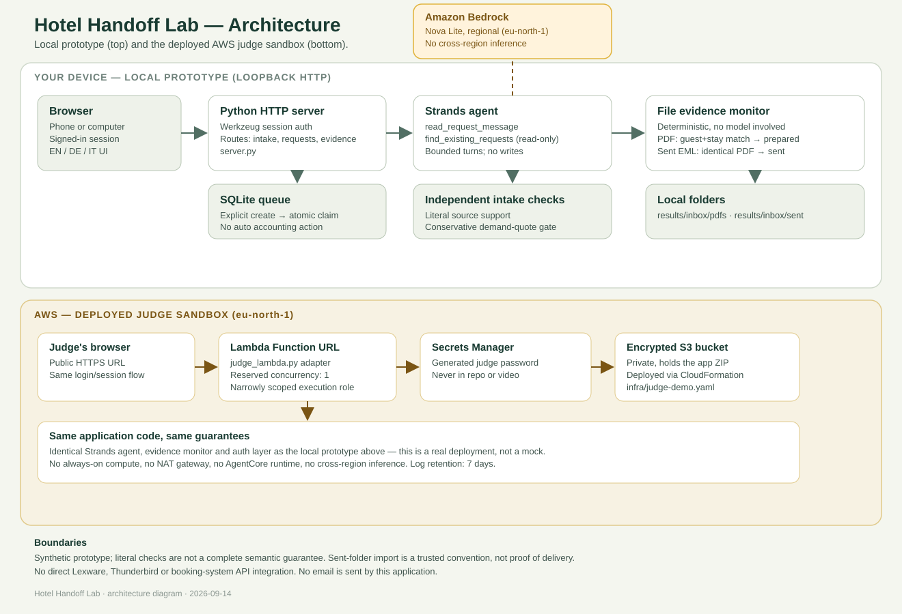

# Architecture

> **Status: not yet manually reviewed.** Written by an agent; awaiting human review.



```text
Synthetic guest message
        |
        v
Strands / regional Bedrock Nova Lite
  |-- read_request_message (read only)
  |-- find_existing_requests (read only)
        |
        v
Structured invoice proposal with literal field quotes
        |
        v
Literal quotation gate -> authenticated staff session -> staff review and explicit confirmation
        |
        v
SQLite invoice queue -> atomic staff claim -> Lexware browser link
        |
        v
Independent local file monitor
  |-- PDF: unique guest + stay text match -> prepared
  |-- exported Sent EML: identical PDF attachment hash -> sent
  |-- ambiguous/unmatched evidence -> pending or review
```

The browser uses a loopback-only Python HTTP server. English, German and Italian
catalogs are local. The agent cannot create or update requests; staff confirm them.
Quotation validation proves literal occurrence, not semantic correctness.
The monitor is deterministic and separate from AI. Sent-folder imports are a
trusted convention, not delivery proof. No email is sent by the application.

The deployed judge sandbox (eu-north-1) runs the identical application code
behind a Lambda Function URL: `judge_lambda.py` adapts the same server, a
generated password lives in Secrets Manager, and the app ZIP is stored in a
private encrypted S3 bucket, all provisioned via `infra/judge-demo.yaml`. No
always-on compute, NAT gateway, AgentCore runtime, or cross-region inference.

The earlier general handoff CLI remains separate from the invoice application.
